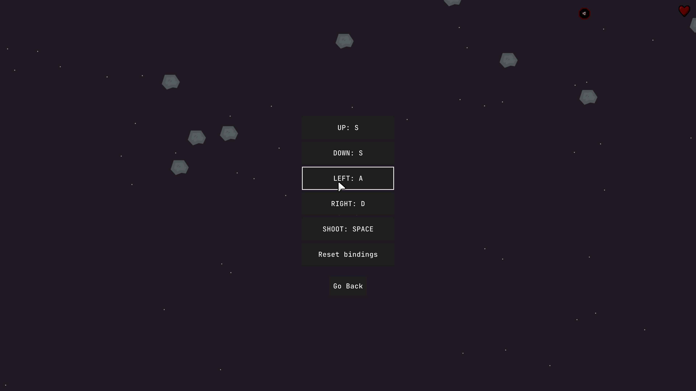
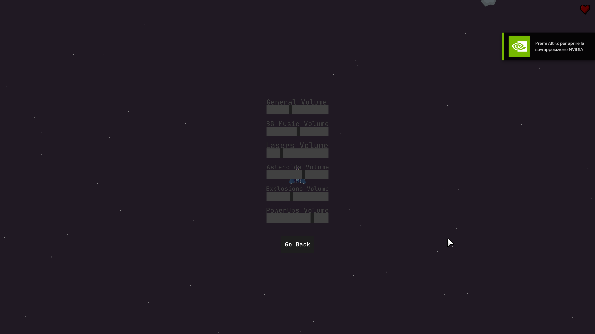
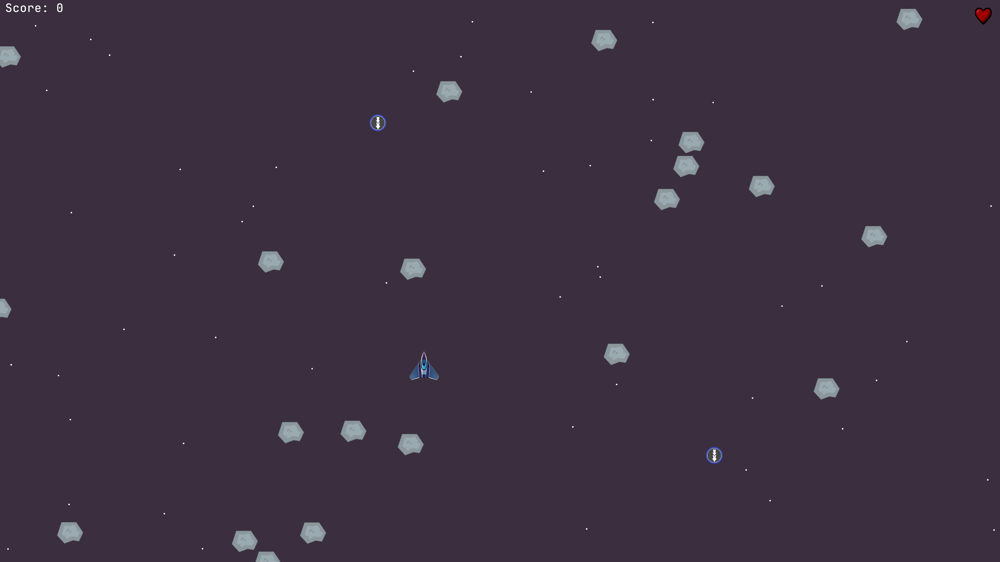

# Space Invaders 

A modern C++17 implementation of the classic "Space Invaders" arcade game, featuring smooth animations, power-ups, audio effects, and a responsive UI. Built using [Raylib](https://www.raylib.com/) for graphics and audio.

## Features

- **Classic Arcade Gameplay**: Control your spaceship, shoot asteroids, and survive as long as possible.
- **Power-Ups**: Collect various power-ups for triple lasers, big lasers, extra hearts, and more.
- **Difficulty Levels**: Choose from multiple difficulty settings (Easy, Normal, Hard).
- **Audio & Visual Effects**: Includes explosion animations and sound effects.
- **Customizable Controls**: Key bindings and audio settings are saved in a JSON file.
- **Responsive Window**: The game window adapts to your screen resolution.
-    

## Screenshots

## Getting Started

### Prerequisites

- C++17 compatible compiler (e.g., MSVC, GCC, Clang)
- [vcpkg](https://github.com/microsoft/vcpkg) for dependency management
- [Premake5](https://premake.github.io/) for project generation
- [Raylib](https://www.raylib.com/) (install via vcpkg)

### Setup and Build Instructions

#### 1. Install Dependencies with vcpkg

Make sure you have [vcpkg](https://github.com/microsoft/vcpkg) installed and integrated with your compiler/IDE.

Install Raylib and any other dependencies: vcpkg install raylib

#### 2. Generate Project Files with Premake5

This project uses [Premake5](https://premake.github.io/) to generate project files.

- Download Premake5 and place the executable in your PATH or project root.
- In the project root, run: premake5 vs2022

This will generate a Visual Studio 2022 solution. For other IDEs or build systems, use the appropriate Premake5 action (e.g., `premake5 gmake2` for GNU Makefiles).

#### 3. Build and Run

- Open the generated solution/project in your IDE (e.g., Visual Studio 2022).
- Build the project.
- Run the executable.

### Project Structure

- Source code is in the main directory.
- Asset files (images, sounds, music) should be placed in the `immagini/` directory as referenced in the code.

## Controls

| Action      | Default Key |
|-------------|-------------|
| Move Up     | W           |
| Move Down   | S           |
| Move Left   | A           |
| Move Right  | D           |
| Shoot       | Space       |

Controls can be customized in the settings menu.

## Power-Ups

- **triploLaser**: Triple shot for a limited time.
- **bigLaser**: Powerful continuous laser.
- **potCuore**: Gain an extra heart (life).
- **depotCuore**: Lose a heart.
- **downgrade**: Temporary speed reduction.

## Settings

- Audio and control settings are saved in `SpaceInvadersSettings.json`.
- Adjust music, sound effects, and difficulty from the in-game menu.

## Assets

- Place all images in the `immagini/` directory as referenced in the code.
- Explosion images: `immagini/esplosioni/0.png` to `immagini/esplosioni/20.png`
- Music: `immagini/game_music.mp3`
- Sound: `immagini/explosion.wav`
- Cursor: `immagini/grogu.png`

## License

This project is licensed under the MIT License. See [LICENSE](LICENSE) for details.

---

*Made with Raylib, vcpkg, Premake5, and C++17.*

